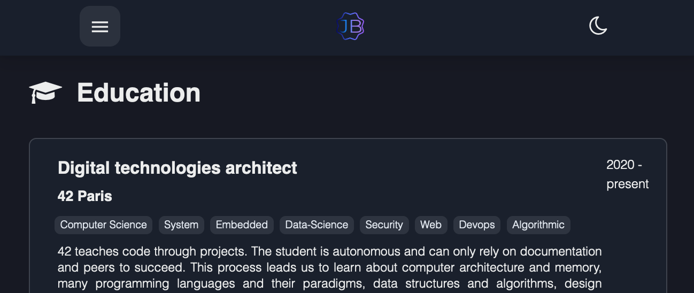

This portfolio is designed as a SPA and inspired by [Angelina Tsuboi](https://github.com/ANG13T).

The front stack is simply html, css, vanilla javascript. The goal of developing a SPA in vanilla javascript is learning how it works under the hood and finally understanding the main element which is the router.

The project is developed and built with vitejs, tested with vitestjs and deployed with github actions on Github Pages.
The website is reachable here: [portfolio](https://jibus22.github.io/).

To run it locally, nodejs and npm must be installed, then just run `npm install` in the root directory then `npm run dev` or `npm run build` then `npm run preview`.

_screenshot of the 'About' page_

